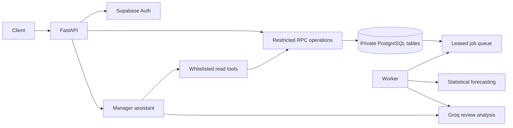

# Architecture

FastAPI validates requests and verifies a Supabase user. Request-scoped clients prevent session state leaking between concurrent users. Private SQL routines independently verify the current profile and enforce transaction invariants. Public RPC wrappers expose whitelisted operations; no arbitrary SQL endpoint exists.

Modules separate HTTP schemas/routes from services. SQL is the authoritative boundary for stock, money, idempotency, permissions and audit. Data-intensive multi-row mutations occur in short transactions; AI/network calls never hold database row locks.

Public RPCs are `sd_read`, `sd_command` and service-only `sd_service`. Dispatch is a fixed list of operations, not dynamic input SQL. Private entry routines have restricted execute grants, explicit authorization and fixed search paths. Direct business-table privileges are revoked.

The backend uses a server secret only for Auth administration and narrowly defined internal service operations. Ordinary staff/manager commands use the caller JWT. AI outputs can only be persisted through service-only operations, preserving their provenance.

The worker uses leases, ownership tokens and conditional completion. Database fencing prevents expired workers from overwriting newer results. Forecast/review results and job completion commit together. Retry failures are recorded, not silently discarded.

Audit is append-only through internal routines. Financial snapshots preserve historical costs after recipe or price changes. Review text and tool results are untrusted input to AI; the model has no mutation or arbitrary-query tool.
